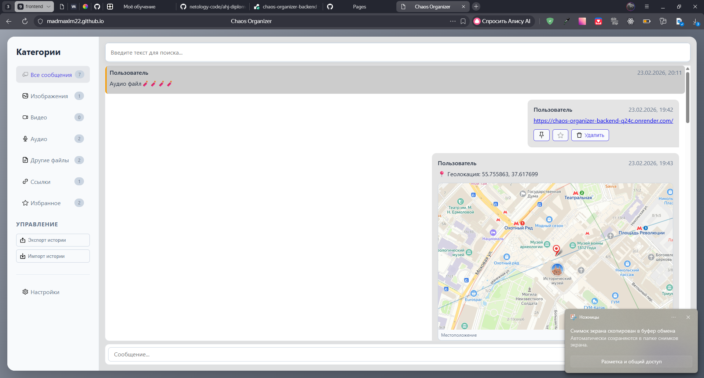
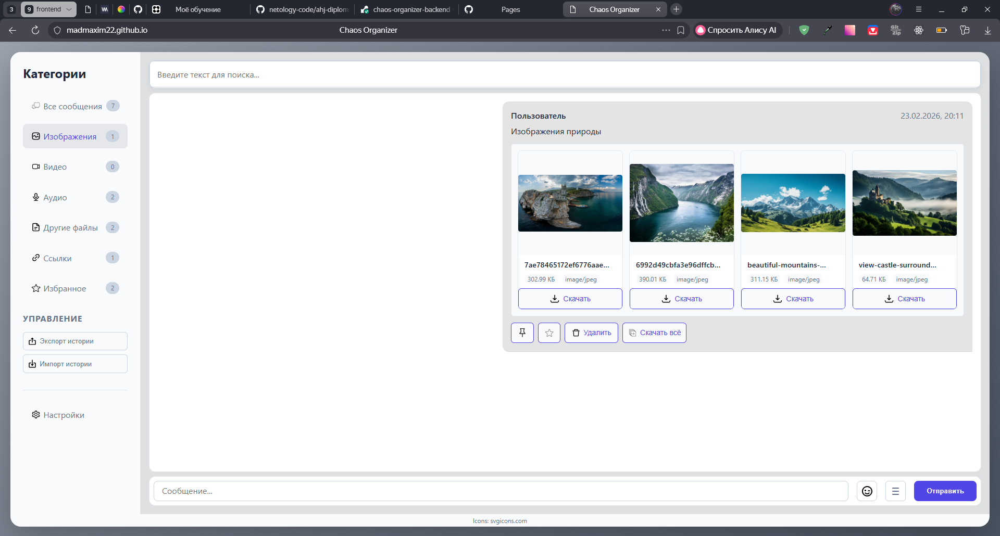
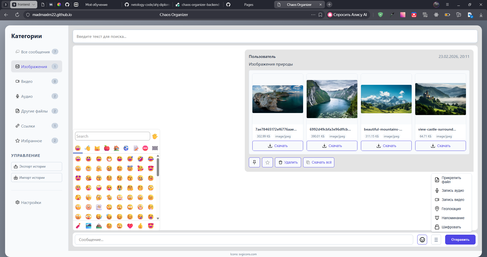
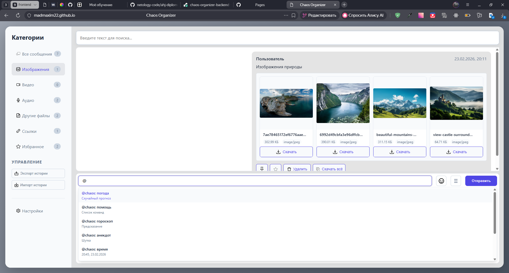
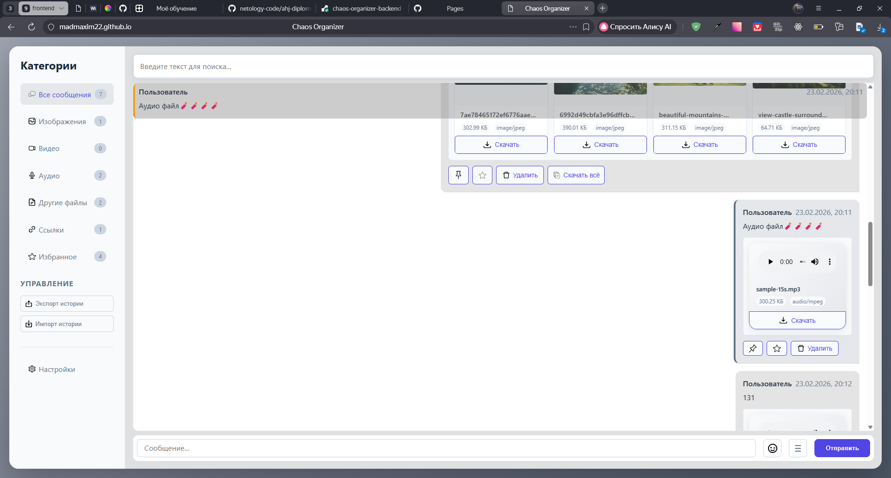
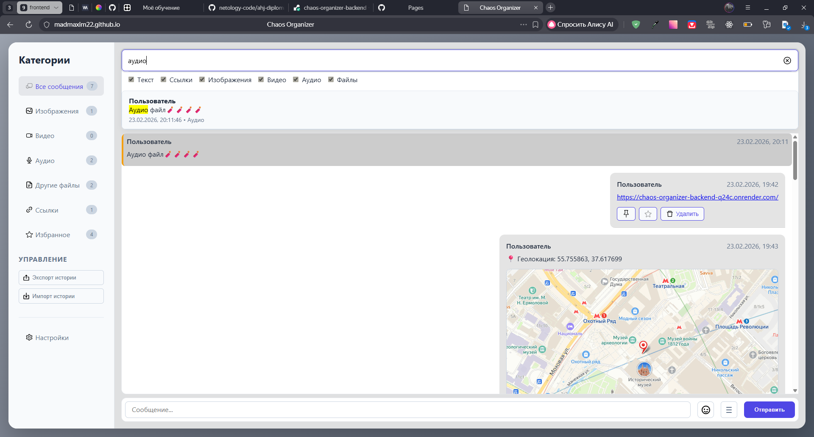
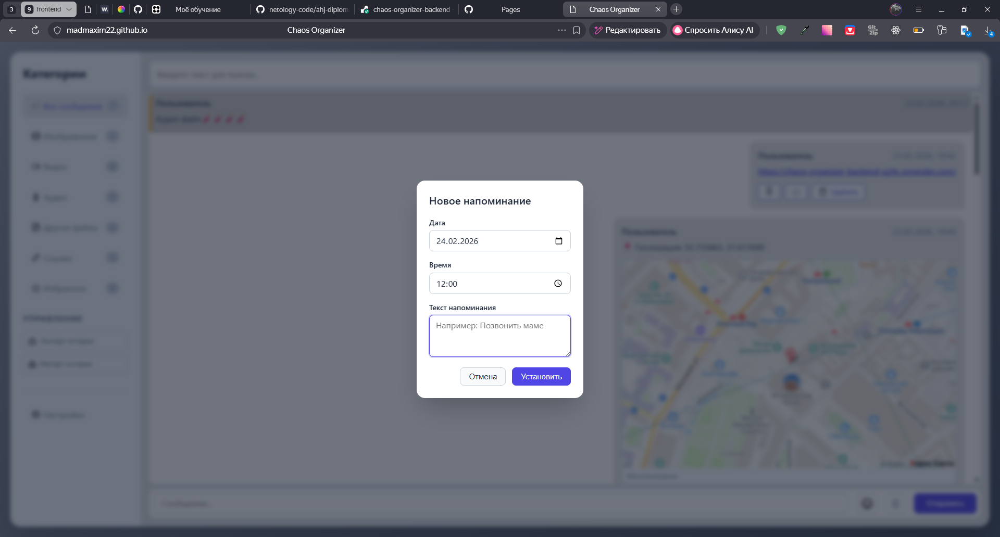

# Chaos Organizer — Документация

Органайзер в формате мессенджера: вы отправляете боту сообщения, файлы и команды — он хранит, ищет, напоминает и синхронизирует данные между вкладками.

---

## Содержание

- [Реализованные функции](#реализованные-функции)
- [Как пользоваться](#как-пользоваться)
- [Запуск проекта](#запуск-проекта)
- [Схемы работы](#схемы-работы)

---

## Реализованные функции

### Обязательные

| Функция | Реализация |
|--------|------------|
| **Сохранение текста и ссылок** | Текстовые сообщения и ссылки (`http://` и `https://`) сохраняются в истории. Ссылки отображаются кликабельными. |
| **Изображения, видео и аудио** | Загрузка через **Drag & Drop** (перетаскивание в область ввода) и через кнопку **«Прикрепить файл»** в бургер-меню. Файлы сохраняются на сервере и отображаются в чате. |
| **Скачивание файлов** | У каждого вложения есть кнопка скачивания. У сообщения с несколькими файлами — кнопка **«Скачать все»**. |
| **Ленивая подгрузка** | Сначала загружаются последние 10 сообщений. При прокрутке **вверх** подгружаются следующие 10 и так далее. |

### Дополнительные (выбрано более 5)

| Функция | Реализация |
|--------|------------|
| **Синхронизация между вкладками** | WebSocket: новые, изменённые и удалённые сообщения сразу отображаются во всех открытых окнах. |
| **Поиск по сообщениям** | Строка поиска сверху. Фильтры по типам: текст, ссылки, изображения, видео, аудио, файлы. Результаты подсвечиваются, можно перейти к сообщению. |
| **Запись аудио и видео** | В бургер-меню: **«Запись аудио»** и **«Запись видео»** (MediaRecorder API). Записанный файл можно отправить как сообщение. |
| **Геолокация** | Кнопка **«Геолокация»** в бургер-меню отправляет текущие координаты; при наличии ключа Yandex показывается статическая карта. |
| **Воспроизведение видео и аудио** | Аудио и видео в сообщениях воспроизводятся прямо в чате (элементы `<audio>` и `<video>`). |
| **Напоминания** | Команда `@schedule: 18:04 31.08.2019 «Текст напоминания»` или кнопка **«Напоминание»** и модальное окно. Уведомления через Notification API. |
| **Команды боту** | В чате: `@chaos: погода`, `@chaos: помощь`, `@chaos: гороскоп`, `@chaos: анекдот`, `@chaos: время`, `@chaos: привет`, `@chaos: напоминания`. Бот отвечает сообщением в том же чате. |
| **Закрепление (pin)** | Одно сообщение можно закрепить — оно фиксируется вверху списка. Кнопка закрепления в меню сообщения. |
| **Избранное** | Кнопка «в избранное» у сообщения. В сайдбаре категория **«Избранное»** — показ только избранных сообщений. |
| **Категории вложений** | В боковом меню: Все сообщения, Изображения, Видео, Аудио, Другие файлы, Ссылки, Избранное. |
| **Офлайн и кэш** | При недоступности сервера показываются последние загруженные сообщения из кэша и уведомление «Офлайн». |
| **Экспорт и импорт истории** | В сайдбаре кнопки **«Экспорт истории»** (скачивание JSON-архива) и **«Импорт истории»** (загрузка архива с диска). |
| **Шифрование** | Кнопка **«Шифровать»** в бургер-меню. Текст и файлы шифруются (crypto-js) перед отправкой. Просмотр — по кнопке «Расшифровать» с вводом пароля. |
| **Эмодзи** | Поддержка смайликов: пикер эмодзи (кнопка рядом с полем ввода и в бургер-меню), shortcode-подстановка в тексте. |
| **Оформление кода в сообщениях** | Текст в блоках \`\`\` отображается как код с подсветкой. |

---

## Как пользоваться

### Главный экран

Слева — **боковое меню** (категории и экспорт/импорт). В центре — **поиск**, затем **список сообщений** (сверху — закреплённое, если есть). Внизу — **панель ввода**: текст, эмодзи, бургер-меню и кнопка «Отправить».

*Рис. 1 — Главный экран: сайдбар, список сообщений, панель ввода.*

---

### Боковое меню (категории и управление)

- Нажмите на стрелку или область сайдбара, чтобы открыть меню.
- Выберите категорию: **Все сообщения**, **Изображения**, **Видео**, **Аудио**, **Другие файлы**, **Ссылки**, **Избранное** — список сообщений обновится.
- **Экспорт истории** — скачивание архива чата на компьютер.
- **Импорт истории** — выбор JSON-файла архива и восстановление истории.
- **Настройки** — открывает окно настроек приложения.
- **Документация** — открывает эту документацию и схемы работы в браузере.

*Рис. 2 — Боковое меню: категории и кнопки экспорта/импорта.*

---

### Панель ввода и вложения

- Введите текст в поле и нажмите **Отправить** или Ctrl+Enter.
- **Эмодзи** — кнопка смайлика открывает пикер эмодзи.
- **Бургер-меню** (три полоски) открывает:
  - **Прикрепить файл** — выбор файлов с диска.
  - **Запись аудио** — запись голоса, затем отправка.
  - **Запись видео** — запись с камеры в отдельном окне, затем отправка.
  - **Геолокация** — отправка текущих координат (и карты при настройке ключа).
  - **Напоминание** — открывает окно ввода даты/времени и текста напоминания.
  - **Шифровать** — включение/выключение шифрования следующего сообщения (пароль запрашивается при отправке и при просмотре).

Перетаскивание файлов в область ввода также прикрепляет их к сообщению.

*Рис. 3 — Панель ввода и бургер-меню с действиями.*

---

### Палитра команд (@)

В поле ввода начните вводить **@** — появится палитра команд. Можно выбрать:

- **@chaos: погода** — случайный прогноз погоды.
- **@chaos: помощь** — список команд бота.
- **@chaos: гороскоп** — случайный знак и предсказание.
- **@chaos: анекдот** — случайная шутка.
- **@chaos: время** — текущее время.
- **@chaos: привет** — приветствие бота.
- **@chaos: напоминания** — список ваших напоминаний.
- **@schedule: HH:MM DD.MM.YYYY «Текст»** — создание напоминания на указанные дату и время.

Выбор пункта вставляет команду в поле; отправка сообщения выполняет её (бот отвечает в чате или создаётся напоминание).

*Рис. 4 — Палитра команд при вводе «@».*

---

### Закрепление и избранное

- У каждого сообщения в меню (три точки или иконки действий) есть:
  - **Закрепить** — сообщение фиксируется вверху списка (одно закреплённое).
  - **В избранное** — добавление/удаление из избранного (звёздочка).
  - **Удалить** — удаление сообщения.
  - **Скачать** — для вложений.
  - **Расшифровать** — для зашифрованных сообщений (ввод пароля).

*Рис. 5 — Закреплённое сообщение сверху и кнопки «В избранное» у сообщений.*

---

### Поиск

- Введите запрос в строку поиска сверху — поиск выполняется с задержкой.
- Раскройте фильтры (иконка/область рядом с полем) и отметьте типы: **Текст**, **Ссылки**, **Изображения**, **Видео**, **Аудио**, **Файлы**.
- В блоке под полем отображаются найденные сообщения; клик по результату прокручивает ленту к этому сообщению.

*Рис. 6 — Поиск с фильтрами по типам контента.*

---

### Напоминания

- Через команду: `@schedule: 18:04 31.08.2019 «Купить молоко»` (время, дата, текст в кавычках или без).
- Или кнопка **«Напоминание»** в бургер-меню → ввод даты, времени и текста в модальном окне.
- В назначенное время браузер покажет уведомление (Notification API), если разрешения даны.

*Рис. 7 — Создание напоминания через команду или модальное окно.*

---

### Шифрование

- В бургер-меню нажмите **«Шифровать»** (иконка замка). Следующее сообщение (текст и/или файлы) будет зашифровано.
- При отправке запрашивается пароль. Получатель (вы в другой вкладке или после перезагрузки) нажимает **«Расшифровать»** у сообщения и вводит тот же пароль для просмотра.

*Рис. 8 — Режим шифрования и просмотр расшифрованного сообщения.*

---

## Запуск проекта

- **Backend:** развёрнут на [Render](https://render.com). Локально: в каталоге `chaos-organizer-backend` выполните `npm install` и `npm start`. Подробности — в [chaos-organizer-backend/README.md](https://github.com/Madmaxim22/chaos-organizer-backend).
- **Frontend:** в каталоге `chaos-organizer-frontend` выполните `npm install` и `npm run start` (или `npm run build:prod` и раздавайте папку `build/`). В настройках или через переменные окружения (`.env`: `API_URL`) укажите URL API бэкенда (для демо — URL бэкенда на Render).

После запуска откройте фронтенд в браузере; чат будет обращаться к API и WebSocket бэкенда.

---

## Схемы работы

Описание потоков данных и взаимодействия компонентов см. в отдельном файле **[SCHEMAS.md](SCHEMAS.md)**.

---
