# Схемы работы функций Chaos Organizer

В этом файле описаны потоки данных и взаимодействие компонентов фронтенда. Диаграммы в формате Mermaid можно просматривать в редакторах с поддержкой Mermaid (VS Code, GitHub, GitLab и т.п.) или на [mermaid.live](https://mermaid.live).

---

## 1. Инициализация приложения

При создании экземпляра `ChaosOrganizerApp` применяются настройки, инициализируются компоненты, подключается WebSocket и загружаются сообщения после готовности эмодзи.

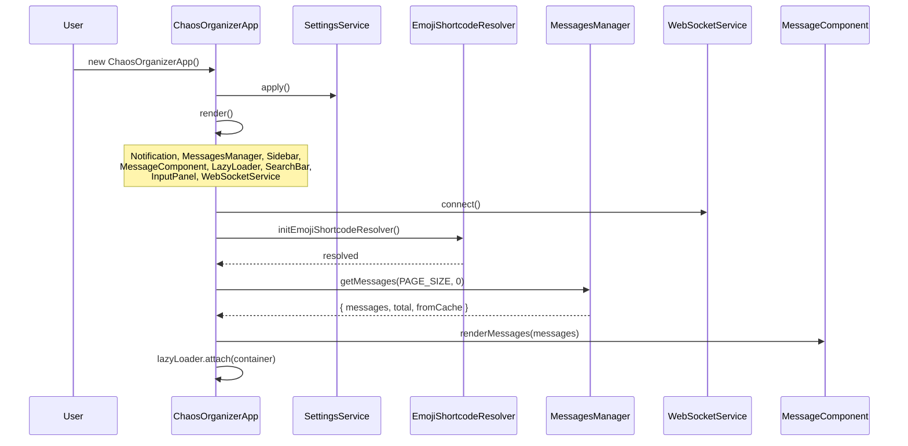

---

## 2. Отправка сообщения

Пользователь вводит текст и/или прикрепляет файлы. При нажатии «Отправить» формируется `MessageSendModel`, при включённом шифровании — шифруются текст и файлы. Данные отправляются через API; при ответе бота отображаются оба сообщения.

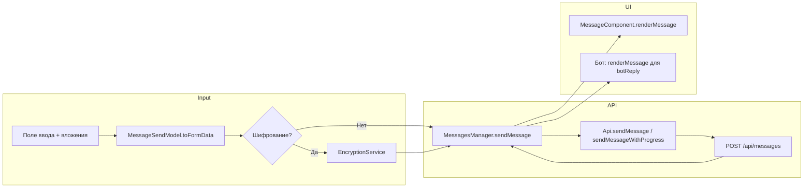

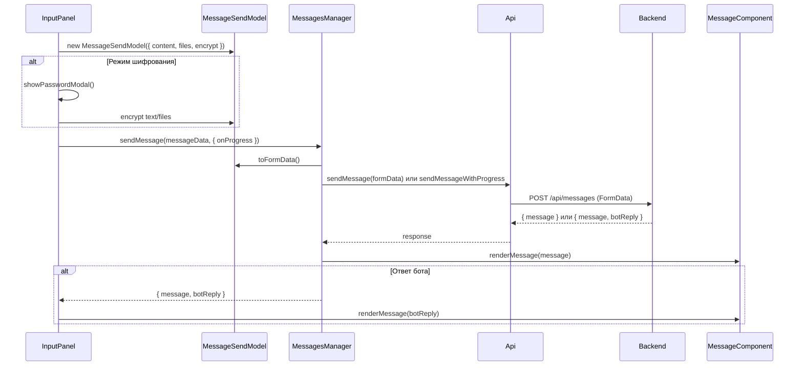

---

## 3. Загрузка сообщений и ленивая подгрузка

Первая страница запрашивается при старте или при смене категории в сайдбаре. Ленивая подгрузка срабатывает при прокрутке вверх: `LazyMessagesLoader` отслеживает `scrollTop` и запрашивает следующую порцию через `getMessagesByCategory(categoryId, limit, offset)`.

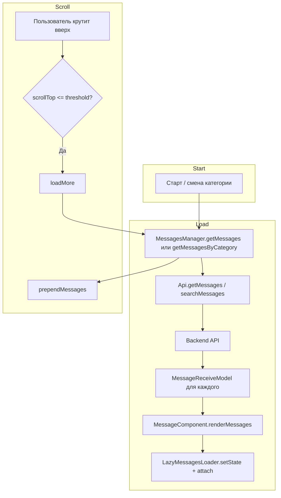

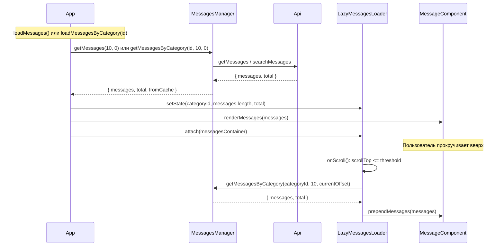

---

## 4. Синхронизация между вкладками (WebSocket)

После подключения к `ws://.../ws` сервер присылает события `new_message`, `message_updated`, `message_deleted`. Обработчики обновляют список сообщений без перезагрузки страницы.

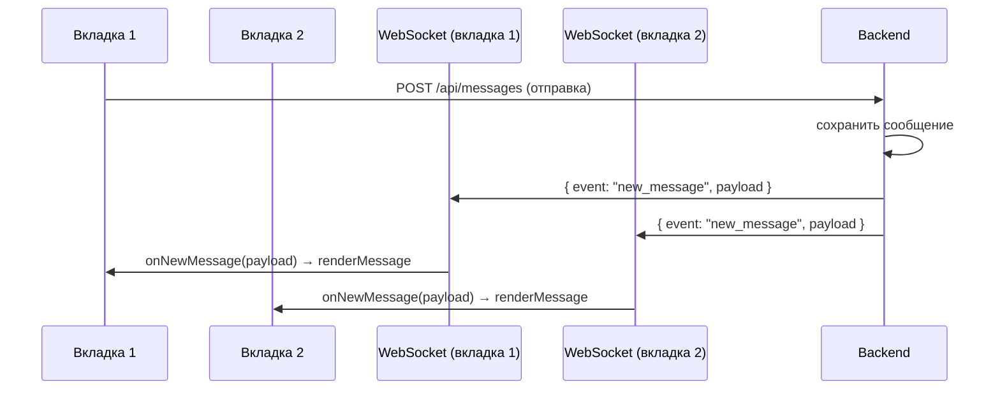

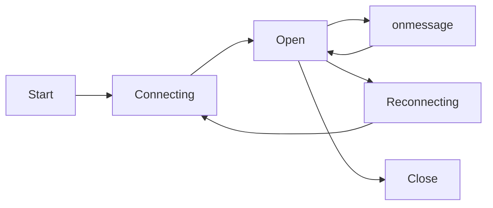
*Состояния WebSocket: подключение → открыто → по сообщению остаётся открытым; при обрыве — реконнект.*

---

## 5. Поиск по сообщениям

Ввод в поле поиска с debounce вызывает `MessagesManager.searchMessages(query, filters)`. Фильтры (чекбоксы) формируют объект `type` и другие параметры. Результаты показываются в выпадающем блоке; клик по результату прокручивает ленту к сообщению.

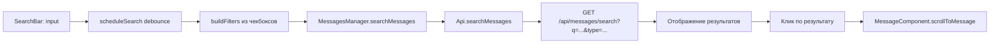

---

## 6. Напоминания

Напоминание создаётся либо парсингом команды `@schedule: HH:MM DD.MM.YYYY «Текст»` из поля ввода, либо через модальное окно (кнопка «Напоминание» в бургер-меню). `ReminderService` запрашивает разрешение Notification API, планирует `setTimeout` на время срабатывания и показывает уведомление.

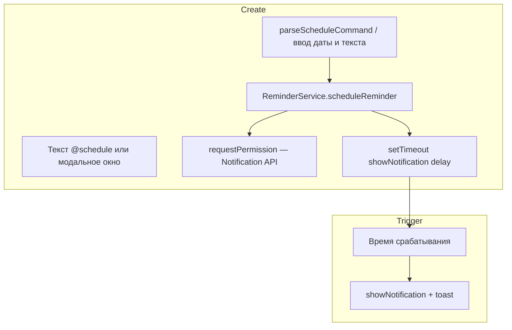

---

## 7. Экспорт и импорт истории

Экспорт: по кнопке в сайдбаре вызывается `ExportImportService.exportHistory()` → `MessagesManager.exportHistory()` (API возвращает Blob) → скачивание файла через создание `<a download>`. Импорт: выбор файла → `MessagesManager.importHistory(file)` (POST с файлом) → после успеха вызывается `loadMessages()` для обновления списка.

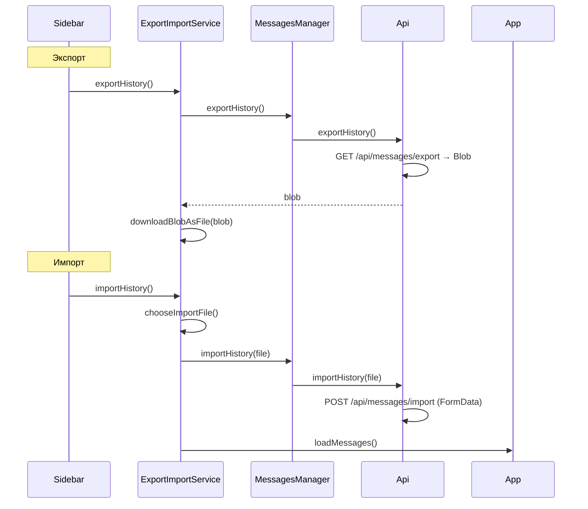

---

## 8. Закрепление и избранное

Закрепление: вызов `MessagesManager.pinMessage(id, true)` → API обновляет сообщение → WebSocket рассылает `message_updated`; на фронте `MessageComponent.updateMessageInList` обновляет элемент, `PinnedMessageHandler` выносит закреплённое в блок сверху. Избранное: `MessagesManager.favoriteMessage(id, true)` — аналогично через API и при необходимости через WebSocket/обновление списка.

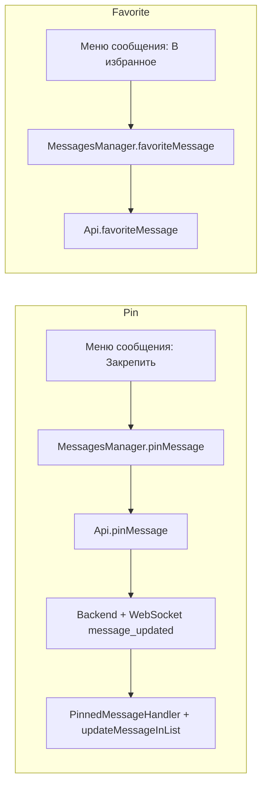

---

## Основные компоненты и сервисы

| Компонент / сервис | Назначение |
|-------------------|------------|
| `ChaosOrganizerApp` | Точка входа, инициализация и связка всех модулей |
| `MessagesManager` | Работа с API: получение, отправка, удаление, поиск, категории, pin/favorite, экспорт/импорт |
| `ApiService` | HTTP-запросы к бэкенду (fetch), формирование URL и заголовков |
| `WebSocketService` | Подключение к `/ws`, обработка событий new_message, message_updated, message_deleted, реконнект |
| `LazyMessagesLoader` | Обработчик скролла, подгрузка следующей страницы при прокрутке вверх |
| `MessageComponent` | Отрисовка списка сообщений, превью вложений, действия (pin, избранное, удалить, скачать, расшифровать) |
| `InputPanel` | Поле ввода, вложения, бургер-меню (файл, аудио, видео, гео, напоминание, шифрование), палитра команд @ |
| `SearchBar` | Поле поиска, фильтры по типу, debounce, отображение результатов и переход к сообщению |
| `Sidebar` | Категории, экспорт/импорт, настройки, документация |
| `ReminderService` | Парсинг @schedule, планирование уведомлений (setTimeout), Notification API |
| `ExportImportService` | Вызов API экспорта/импорта, выбор файла, скачивание Blob |

---

*Файл создан для проекта Chaos Organizer. Схемы соответствуют коду фронтенда в `chaos-organizer-frontend/src`.*
